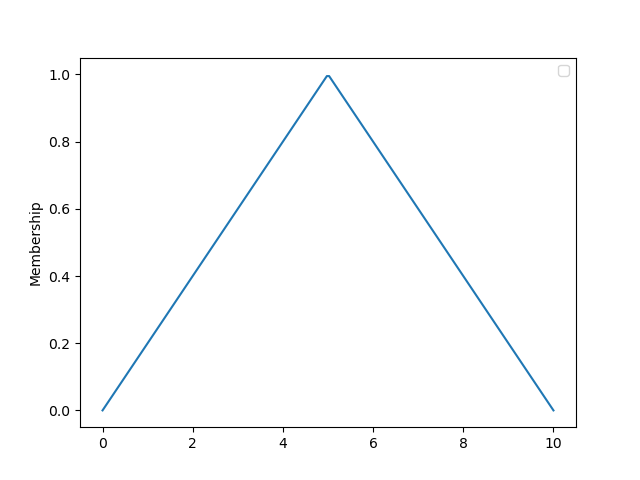
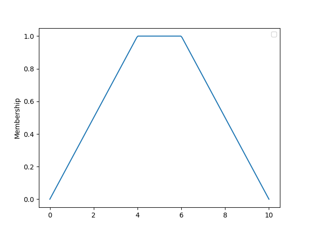
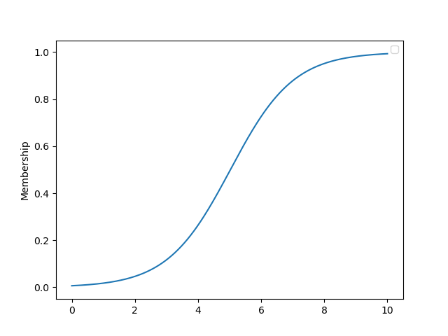
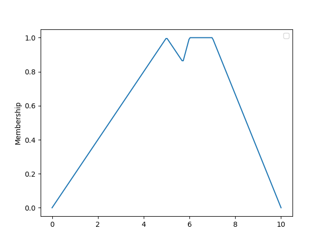

Isabella Sierra
# Sistema de Inferencia Difusa   

En la implementación de un sistema de inferencia difusa debemos garantizar las siguientes componentes:

- Definición de variables linguísticas y adjetivos asociados al problema: Para ello debemos implementar también las funciones de membresía relativas a cada adjetivo.
- Definición de reglas: Para ello debemos implementar predicados y operaciones entre ellos.
- Fusificación de la entrada y defusificación de la salida: Para ello debemos implementar un *conjunto difuso*, con sus respectivos métodos de *fusificación* y *defusificación*. 

## Variables linguísticas y adjetivos

Una variable linguística es algo similar a un sustantivo, que puede ser descrito por un conjunto de adjetivos. En nuestro modelo una variable linguística se representa con el tipo `LinguisticVariable`. 
 
Una instancia de `LinguisticTerm` tiene las propiedades:

- `name`: Representa el valor simbólico de la variable. En el caso de la oración *el juego es divertido*, dicho valor simbólico sería *juego*.
- `adjectiveDomain`: Conjunto de adjetivos que admite la variable. En el caso de un *juego*, podemos decir que dicho dominio está constituido por *divertido, normal, aburrido*. 

El conjunto de adjetivos que puede tomar una variable linguística queda modelado por el tipo `Adjective`. 

Una instancia de `Adjective` tiene las propiedades:

- `name`: Representa el valor simbólico del adjetivo. En el caso de *el juego es divertido*, dicho valor simbólico sería *divertido*. 
- `membershipFunction`: Función que representa los niveles de membresía de un elemento de un dominio cuantitativo determinado, al espacio delimitado por el adjetivo. 

## Funciones de membresía

En la lógica convencional, un *juego* puede ser categorizado de *divertido* o *aburrido*. Pero, ¿cómo modelamos los términos medios? 

La lógica difusa ofrece una manera de determinar un grado de pertenencia a una categoría. Es decir, un juego puede ser *más o menos divertido*. 

Para ello definimos una función $f$, con imagen en el intervalo (0,1), donde si $f(x)=1$ se dice que $x$ cumple totalmente con la categoría y si $f(x)=0$ se dice que $x$ no cumple con la categoría. 

Para adecuarlo a los términos que hemos estado utilizando, decimos que una función $f$ se le asocia a un adjetivo para determinar en qué grado éste se puede atribuir a un sustantivo.

Una función de membresía es modelada por el tipo `Membership`, que consta de las siguientes propiedades: 

- `function`: Función matemática que define la membresía.
- `domain`: Intervalo de definición de la función. 

y los siguientes métodos:

- `plot`: Grafica la función `function`.
- `__call__(x)`: Retorna la evaluación de `function(x)`.
- `compose(other)`: Retorna un nuevo `Membership` con `function = max(self.function, other.function)` y su `domain = union(self.domain, other.domain)`.
- `clip(x)`: Retorna un nuevo `Membership` con `function = min(self.function, x)` y `domain = self.domain`.
- `scale(x)`: Retorna un nuevo `Membership` con `function = self.function * x` y `domain = self.domain`.

Para definir nuevas funciones de membresía utilizamos tipos que heredan de `Membership`. 
Ya existen implementadas las siguientes:

- `TriangleMembership`: Se construye con los parámetros `start`, `peak`, `end`. Por ejemplo, si hacemos:
    
        t=TriangleMembership(0,5,10)
        t.plot()

    obtenemos:

    
    
- `TrapezoidMembership`: Se construye con los parámetros `start`, `first_peak`, `second_peak`, `end`. Por ejemplo, si hacemos:

        t=TrapezoidMembership(0,4,6, 10)
        t.plot()

    obtenemos:

    

- `SigmoidMembership`: Se construye con el parámetro `growth`, por defecto `growth=1`. Por ejemplo, si hacemos:

        s=SigmoidMembership()
        s.plot()
    
    obtenemos:

    

## Expresiones

Para definir un predicado utilizamos la clase abstracta `Expression`, de la cual se derivan:

 - `AndExpression(BinaryExpression)` -> `Expression` y `Expression`
 - `OrExpression(BinaryExpression)` -> `Expression` o `Expression`
 - `AtomicExpression(UnaryExpression)` -> `LinguisticVariable` es `Adjective`
 - `NotExpression(UnaryExpression)` -> no `Expression`
  
Una expresión atómica consta del método `fuzzify`, que es capaz de recibir una entrada y fusificarla en el conjunto difuso definido por la función de membresía asociada a su adjetivo. 

## Definición de reglas

Las reglas constan de dos partes, un antecedente A y un consecuente B, que se presentan de la forma:

    Si A se cumple, entonces se cumple B.

En nuestro caso, modelamos las reglas con el tipo `Rule`, que consta de las propiedades `antecedent` y `consequent`. 

## Conjuntos difusos

Los conjuntos difusos son modelados utilizando el tipo `FuzzySet`, construido con el argumento `elements` de tipo `List<Membership>`.

Consta de los métodos:

  - `plot`: Se grafica la composición de todos los `elements`. Por ejemplo:

        triangle=TriangleMembership(0, 5, 10)
        trapezoid=TrapezoidMembership(4, 6, 7, 10)
        
        f=FuzzySet([triangle, trapezoid])
        f.plot()

    obtenemos:

    

  - `defuzzify`: Se defusifica el conjunto. Para seleccionar el método deseado, se llama al método con uno de los siguientes argumentos: `'centroid'`, `'sums'`, `'bisection'`, `'LOM'`, `'MOM'`, `'FOM'`; que corresponden a los métodos del *centroide, centro de sumas, bisección, último de los máximos, media de los máximos* y *primero de los máximos* respectivamente. 

## Aplicación del Sistema de Inferencia Difusa

Para aplicar el sistema al problema particular de clasificación de juegos, debemos seguir los siguientes pasos:

- Definir las variables linguísticas que participan. En nuestro caso, serán *duración*, *dificultad* e *incertidumbre*, que pueden tomar los adjetivos *baja*, *media* y *alta*:
        
        low = Adjective('low', Triangle(0, 0, 5))
        medium = Adjective('medium', Triangle(3, 5, 7))
        high = Adjective('high', Triangle(6, 10, 10))
        dur=LinguisticVariable('duration', [low, medium, high])

    y así con el resto de las variables. Nuestra variable salida será cuán entretenido es un juego:

        boring = Adjective('boring', Triangle(0, 0, 5))
        meh = Adjective('meh', Triangle(3, 5, 7))
        fun = Adjective('fun', Triangle(6, 10, 10)) 

- Luego, para auxiliarnos en la construcción de las reglas, podemos definir todas las sentencias posibles de la siguiente forma: 
 
        short_game = Statement(duration, low_duration)

- Definir las reglas auxiliándonos de las expresiones, por ejemplo:

        rule = Rule(short_game.Or(easy_game), boring_game)

- Luego, utilizando todas las reglas, construir un conjunto de reglas de la forma:

        rule_set= RuleSet([first_rule, second_rule, third_rule,...])

- Para aplicar el sistema de inferencia, basta entonces llamar el conjunto con un diccionario que contenga como llave el símbolo del adjetivo que se cuantificó, el método de desdifusificación que se desea utilizar (centroide por defecto) y el método de agregación que se desea utilizar (*Mamdani* o *Larsen*, *Mamdani* por defecto):

        result = rule_set({'duration':5, 'difficulty':2, 'randomness':5}, a_method = 'Mamdani', d_method = 'centroid')

## Utilización del módulo *gameEvaluator*

Basta importar el conjunto de reglas de la forma:

        from gameEvaluator import rule_set

y realizar un llamado de la forma:

        rule_set({'key':value, ...}, a_method='Larsen', d_method='LOM')

por ejemplo. 

- En caso de que se quieran definir nuevas funciones de membresía se puede realizar implementando un tipo que herede de `Membership`:

        from membership import Membership

        class MyMembership(Membership):
                def __init__(self, init_parameters):
                        def myFunction(x):
                                ...
                        return super().__init__(myFunction, myDomain)

o directamente creando una instancia de tipo `Membership`:

        myMembership = Membership(myFunction, myDomain)

- En caso de que se quieran definir nuevas variables linguísticas se puede realizar de la forma:

        from variable import LinguisticVariable, Adjective

        adjective_1 = Adjective('adjective_1', myMembership)
        adjective_2 = Adjective('adjective_2', myMembership)
        adjective_3 = Adjective('adjective_3', myMembership)

        variable = LinguisticVariable('variable', [adjective_1, adjective_2])

        output_variable = LinguisticVariable('variable', [adjective_3])

- En caso de que se quieran definir nuevos predicados se puede realizar de la forma:

        predicate_1 = Statement(variable, adjective_1)
        predicate_2 = Statement(variable, adjective_2)
        predicate_3 = Statement(output_variable, adjective_3)

- En caso de que se quieran definir nuevas reglas y agregarlas al conjunto de reglas previamente definido, se haría de la forma: 

        from rule import Rule
        rule = Rule(predicate_1.And(predicate_2), predicate_3)
        rule_set.append(rule)

        
    
    
